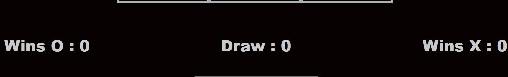
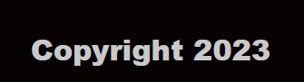

# **TiC TaC ToE** 

Games played on three-in-a-row boards can be traced back to ancient Egypt, where such game boards have been found on roofing tiles dating from around 1300 BC.
An early variation of tic-tac-toe was played in the Roman Empire, around the first century BC.

This game is for two players who take turns marking the spaces in a three-by-three grid with X or O. The player who succeeds in placing three of their marks in a horizontal, vertical, or diagonal row is the winner. It is a solved game, with a forced draw assuming best play from both players.

responsive screenshot
- ## **Features**
- ## The header
  - The header shows the name of the game 'TiC TaC ToE' and also the logo of the game.

- ## Comment
  - Let's play...enjoy!
     - This comment is to give you more fun, enjoy the game and parallel to be ready for the game with the other user.

- ## Player's turn
  - In this area shows which player's turn is X or O.

 

 - ## Game area
  - In this area is all the game! 
  The background is black and the marks are Neon letters so you can see the contrast and for more design.
  when you win the letter is blinking and also it is a winning sound (tadaa).

 

 - ## result area
  - This area shows the results. winner X or winner O or Draw. With that you have a full picture for the results.

 

 - ## Start-reset button
  - In this area it is a button that doing start and also reset button. 
  When the game is starting it is appearing the word start. During the play the button is disable and when the game finish the reset button is ready for the next game.

    

 - ## footer
  - Minimal footer that is saying the copyright date 2023.

 
 

- ## Testing
  - I tested and that page works in different broswsers, Chrome, Safari, Firefox.
  - I confirm that this project is responsive, looks good and functions on all standard screen sizes using the     devtools device toolbar.
  - I confirmed that all the page with the game are all readable and easy to understand. 

- ## Validator Testing
  - HTML 
    - No errors were returned when passing through the official W3C validator
  - CSS
    - No errors were found when passing through the official (Jigsaw) validator
  - Js
    - No errors were found when passing through the official (jshint) validator

- ## Unfixided bags
    - No bags

- ## Deployment
    - The site was deployed to GitHub pages. The steps to deploy are as follows:
    - In the GitHub repository,navigate to the Settings tab
    - From the source section drop-down menu, select the Master Branch
    - Once the master branch has been selected, the page will be automatically refreshed with a detailed ribbon 
     display to indicate the successful deployment.
    - The link can be found:

- ## Credits
 - ### Content
   - https://en.wikipedia.org/wiki/Tic-tac-toe#:~:text=least%20three%20points.-,History,around%20the%20first%20century%20BC.

 - ### Media
   - https://myloview.com/sticker-glowing-neon-line-tic-tac-toe-game-icon-isolated-on-black-background-no-101067CC
   - https://www.shutterstock.com/image-illustration/neon-3d-font-blue-pink-light-1678658893
   - https://www.shutterstock.com/image-illustration/blue-pink-glowing-neon-tube-font-2152817635
   - https://www.freesoundslibrary.com/tada-sound/#google_vignette
   